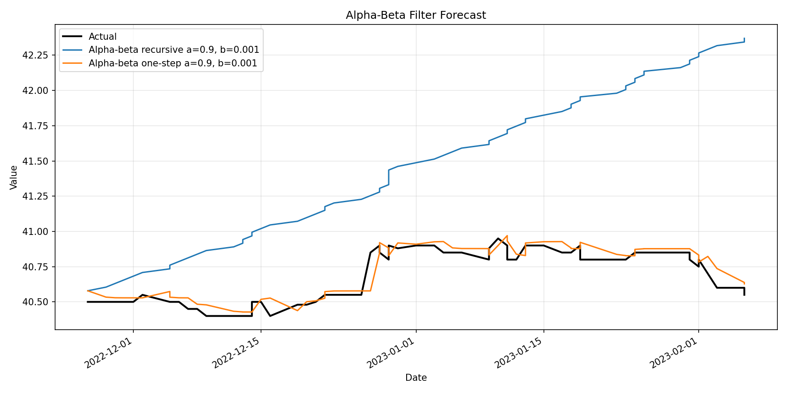

# Time Series Forecasting System

## Опис

**Time Series Forecasting System** - навчальний проєкт для дисципліни **"Технології Data Science"**, виконаний у межах проектного практикуму за ЛР1-2. Проєкт реалізує повний pipeline аналізу та прогнозування часових рядів: від завантаження й очищення реальних даних до порівняння моделей, візуалізації результатів і верифікації на синтетичних рядах.

Основний приклад використання системи - часовий ряд курсу **Oschadbank USD**, на якому перевіряються методи попередньої обробки, виявлення аномалій, статистичного прогнозування, апроксимації, глибинного навчання та рекурентного згладжування.

## Мета роботи

Метою проєкту є побудова відтворюваної системи для дослідження та прогнозування time series даних. У межах роботи потрібно:

- дослідити реальні time series дані;
- очистити дані від аномалій;
- реалізувати прогнозування методами статистичного навчання, апроксимації та глибинного навчання;
- оцінити якість моделей на відкладеній тестовій вибірці;
- виконати верифікацію pipeline на синтетичних даних;
- реалізувати рекурентне згладжування за допомогою alpha-beta filter.

## Використані дані

У проєкті використано часовий ряд **Oschadbank USD exchange rate**:

- сирі дані: [`data/raw/Oschadbank_USD.xls`](data/raw/Oschadbank_USD.xls);
- очищені дані: [`data/processed/oschadbank_usd_clean.csv`](data/processed/oschadbank_usd_clean.csv);
- дані після обробки аномалій: [`data/processed/oschadbank_usd_cleaned_anomalies.csv`](data/processed/oschadbank_usd_cleaned_anomalies.csv).

Нульові значення в ряді трактуються як пропуски або аномальні спостереження, оскільки курс валют не може дорівнювати `0`. Такі значення мають бути виявлені та оброблені перед побудовою моделей.

## Реалізовані методи

### Preprocessing

Модуль попередньої обробки відповідає за підготовку ряду до аналізу: завантаження даних, приведення значень до числового формату, обробку пропусків, очищення некоректних значень і формування підготовленого часового ряду для подальших етапів.

Основні файли:

- [`src/data_loader.py`](src/data_loader.py)
- [`src/preprocessing.py`](src/preprocessing.py)
- [`src/statistics.py`](src/statistics.py)

### Anomaly Detection

У системі реалізовано виявлення аномалій у часовому ряді, зокрема некоректних нульових значень та різких відхилень. Для аналізу використовуються статистичні підходи, зокрема rolling median, z-score та IQR-перевірки.

Основні файли:

- [`src/anomaly_detection.py`](src/anomaly_detection.py)
- [`reports/metrics/anomaly_report.json`](reports/metrics/anomaly_report.json)

### Statistical Learning

Статистичні baseline-моделі використовуються як практична основа для порівняння складніших методів:

- `naive_one_step`
- `naive_recursive`
- `moving_average_one_step`
- `moving_average_recursive`
- `exponential_moving_average_one_step`
- `exponential_moving_average_recursive`

Ці моделі важливі для розуміння того, чи справді складніші підходи покращують прогноз порівняно з простими короткостроковими стратегіями.

Основний файл:

- [`src/models/baseline.py`](src/models/baseline.py)

### Approximation Methods

Для апроксимації ряду реалізовано поліноміальні моделі:

- `global_polynomial`
- `local_polynomial`
- `local_polynomial_one_step`
- `local_polynomial_recursive`

Глобальна поліноміальна модель підбирає одну криву для всього ряду, тоді як локальні моделі працюють із вікном останніх спостережень і краще враховують короткострокові зміни.

Основні файли:

- [`src/models/polynomial.py`](src/models/polynomial.py)
- [`src/models/approximation.py`](src/models/approximation.py)

### Deep Learning

Для нелінійного прогнозування використано MLP-модель:

- `deep_learning_mlp_one_step`

За метриками з [`reports/metrics/forecast_metrics.json`](reports/metrics/forecast_metrics.json), модель працює у one-step режимі з оновленням історії фактичними значеннями.

Основний файл:

- [`src/models/deep_learning.py`](src/models/deep_learning.py)

### Alpha-Beta Filter

Реалізовано alpha-beta filter для рекурентного згладжування та короткострокового прогнозування:

- `alpha_beta_recursive`
- `alpha_beta_one_step`

За [`reports/metrics/alpha_beta_metrics.json`](reports/metrics/alpha_beta_metrics.json), підібрані параметри становлять `alpha = 0.9`, `beta = 0.001`, горизонт прогнозу - `70` точок.

Основний файл:

- [`src/models/alpha_beta_filter.py`](src/models/alpha_beta_filter.py)

### Synthetic Verification

Окремо реалізовано перевірку pipeline на синтетичних рядах із різними типами тренду:

- linear;
- quadratic;
- exponential.

Синтетична верифікація перевіряє, чи здатна система виявляти додані аномалії та відновлювати відомий тренд. Метрики з [`reports/metrics/synthetic_verification.json`](reports/metrics/synthetic_verification.json) показують, що `local_polynomial_one_step` добре відтворює синтетичні тренди: для quadratic-ряду RMSE становить `0.0495`, R2 - `0.9997`.

Основні файли:

- [`src/synthetic.py`](src/synthetic.py)
- [`scripts/run_synthetic_experiment.py`](scripts/run_synthetic_experiment.py)

## Основні результати

Оцінювання виконано на хронологічному поділі даних `70/10/20`: train - `243` спостереження, validation - `35`, test - `70`. Підбір параметрів виконувався на train/validation, фінальна оцінка - тільки на test.

### Порівняння моделей на test-наборі

| Модель | MAE | RMSE | MAPE | R2 |
|---|---:|---:|---:|---:|
| `naive_one_step` | 0.0334 | 0.0581 | 0.0821 | 0.8968 |
| `exponential_moving_average_one_step` | 0.0436 | 0.0648 | 0.1071 | 0.8718 |
| `moving_average_one_step` | 0.0489 | 0.0705 | 0.1201 | 0.8482 |
| `alpha_beta_one_step` | 0.0503 | 0.0647 | 0.1236 | 0.8721 |
| `deep_learning_mlp_one_step` | 0.0613 | 0.0827 | 0.1507 | 0.7911 |
| `local_polynomial_one_step` | 0.0671 | 0.0847 | 0.1648 | 0.7810 |
| `naive_recursive` | 0.1986 | 0.2334 | 0.4867 | -0.6641 |
| `moving_average_recursive` | 0.1986 | 0.2334 | 0.4867 | -0.6641 |
| `exponential_moving_average_recursive` | 0.2004 | 0.2363 | 0.4912 | -0.7061 |
| `alpha_beta_recursive` | 0.7768 | 0.8845 | 1.9069 | -22.9028 |
| `local_polynomial` | 2.3397 | 2.8679 | 5.7397 | -250.2862 |
| `local_polynomial_recursive` | 2.6049 | 3.0506 | 6.3881 | -283.3216 |
| `global_polynomial` | 6.3391 | 7.5841 | 15.5484 | -1756.3581 |

### Висновки за результатами

- Найкращий простий one-step baseline на test-наборі - `naive_one_step` з RMSE `0.0581`.
- Серед online-згладжувальних методів [`reports/metrics/model_recommendations.json`](reports/metrics/model_recommendations.json) рекомендує `alpha_beta_one_step`; його RMSE становить `0.0647`, R2 - `0.8721`.
- `exponential_moving_average_one_step` має близьку якість: RMSE `0.0648`, MAE `0.0436`.
- Recursive-методи можуть накопичувати похибку, оскільки наступні кроки будуються на попередніх прогнозах, а не на фактичних значеннях.
- `global_polynomial` погано працює на цьому нестаціонарному ряді: одна глобальна крива не адаптується до локальних змін курсу.
- `deep_learning_mlp_one_step` є працездатним нелінійним методом, але за наявними метриками не перевершує найкращі короткострокові one-step підходи.
- Synthetic verification підтверджує працездатність pipeline на рядах із відомим трендом і контрольовано доданими аномаліями.

## Приклади графіків

### Очищений та оригінальний ряд


### Порівняння найкращих прогнозів


### Alpha-Beta прогноз



### Синтетична верифікація: quadratic trend


## Структура проєкту

```text
.
|-- data/
|   |-- raw/                  # Сирі дані Oschadbank USD
|   `-- processed/            # Очищені та підготовлені дані
|-- src/
|   |-- data_loader.py        # Завантаження даних
|   |-- preprocessing.py      # Попередня обробка
|   |-- anomaly_detection.py  # Виявлення аномалій
|   |-- statistics.py         # Базова статистика та EDA
|   |-- synthetic.py          # Генерація синтетичних рядів
|   |-- evaluation.py         # Метрики оцінювання
|   `-- models/
|       |-- baseline.py       # Naive, MA, EMA
|       |-- polynomial.py     # Поліноміальні моделі
|       |-- approximation.py  # Апроксимаційні методи
|       |-- deep_learning.py  # MLP-модель
|       `-- alpha_beta_filter.py
|-- scripts/
|   |-- run_pipeline.py
|   `-- run_synthetic_experiment.py
|-- reports/
|   |-- figures/              # PNG-візуалізації
|   `-- metrics/              # JSON-метрики та звіти
|-- requirements.txt
`-- README.md
```

## Як запустити

Встановити залежності:

```bash
pip install -r requirements.txt
```

Запустити основний pipeline для реальних даних:

```bash
python scripts/run_pipeline.py
```

Запустити синтетичний експеримент:

```bash
python scripts/run_synthetic_experiment.py
```

Після запуску результати зберігаються в:

- [`reports/figures/`](reports/figures/)
- [`reports/metrics/`](reports/metrics/)

## Покриття вимог практикуму

| Вимога | Де реалізовано | Статус |
|---|---|---|
| Реальні time series дані | `data/raw/Oschadbank_USD.xls`, `src/data_loader.py` | Реалізовано |
| EDA та базова статистика | `src/statistics.py`, `reports/metrics/basic_statistics.json`, `reports/figures/oschadbank_usd_series.png` | Реалізовано |
| Anomaly cleaning | `src/anomaly_detection.py`, `reports/metrics/anomaly_report.json`, `reports/figures/anomalies_detected.png` | Реалізовано |
| Statistical learning | `src/models/baseline.py`, `reports/metrics/forecast_metrics.json` | Реалізовано |
| Approximation | `src/models/polynomial.py`, `src/models/approximation.py`, `reports/figures/approximation_selection.png` | Реалізовано |
| Deep learning | `src/models/deep_learning.py`, `reports/figures/deep_learning_forecast.png` | Реалізовано |
| Alpha-beta filter | `src/models/alpha_beta_filter.py`, `reports/metrics/alpha_beta_metrics.json`, `reports/figures/alpha_beta_forecast.png` | Реалізовано |
| Model evaluation | `src/evaluation.py`, `reports/metrics/forecast_metrics.json` | Реалізовано |
| Synthetic verification | `src/synthetic.py`, `scripts/run_synthetic_experiment.py`, `reports/metrics/synthetic_verification.json` | Реалізовано |
| Recommendations | `reports/metrics/model_recommendations.json` | Реалізовано |

## English Summary

**Time Series Forecasting System** is an educational Data Science project for time series analysis and forecasting. It uses real Oschadbank USD exchange rate data and implements preprocessing, anomaly detection, statistical baselines, polynomial approximation, an MLP-based deep learning model, alpha-beta filtering, model evaluation, and synthetic verification.

The project compares one-step and recursive forecasting strategies. On the final test split, the strongest simple one-step baseline is `naive_one_step` with RMSE `0.0581`. Among online smoothing methods, `alpha_beta_one_step` is recommended in the generated model recommendations and achieves RMSE `0.0647` with R2 `0.8721`. Recursive methods show error accumulation on longer horizons, while the global polynomial model performs poorly on this non-stationary exchange-rate series.

To run the project:

```bash
pip install -r requirements.txt
python scripts/run_pipeline.py
python scripts/run_synthetic_experiment.py
```

Generated metrics and figures are stored in `reports/metrics/` and `reports/figures/`.
