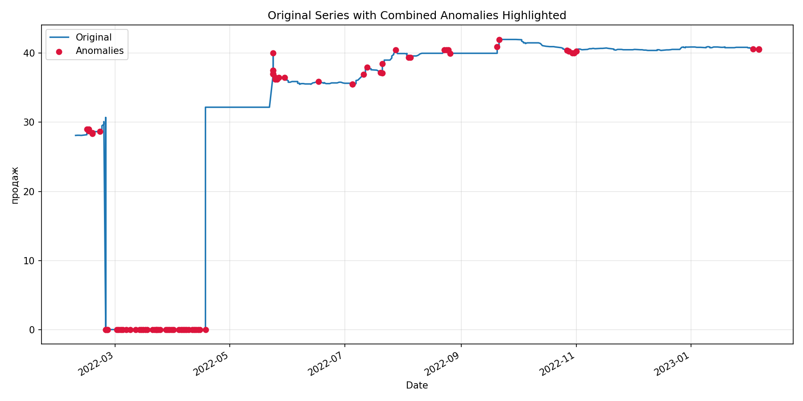
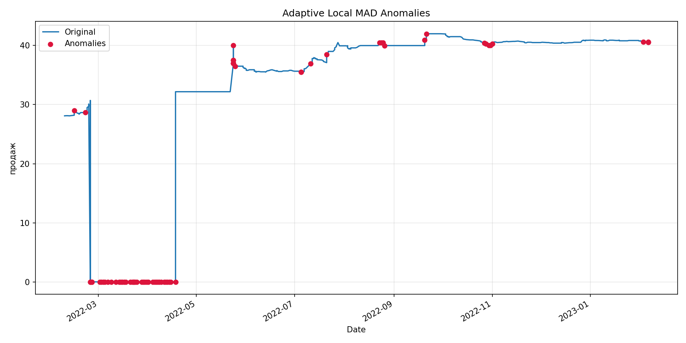
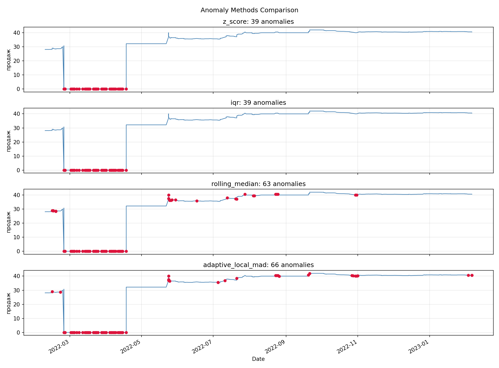
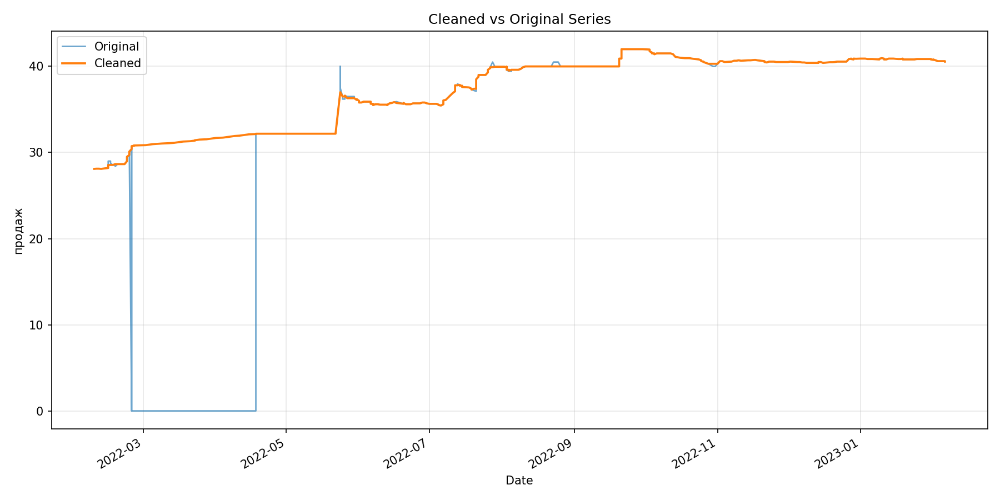
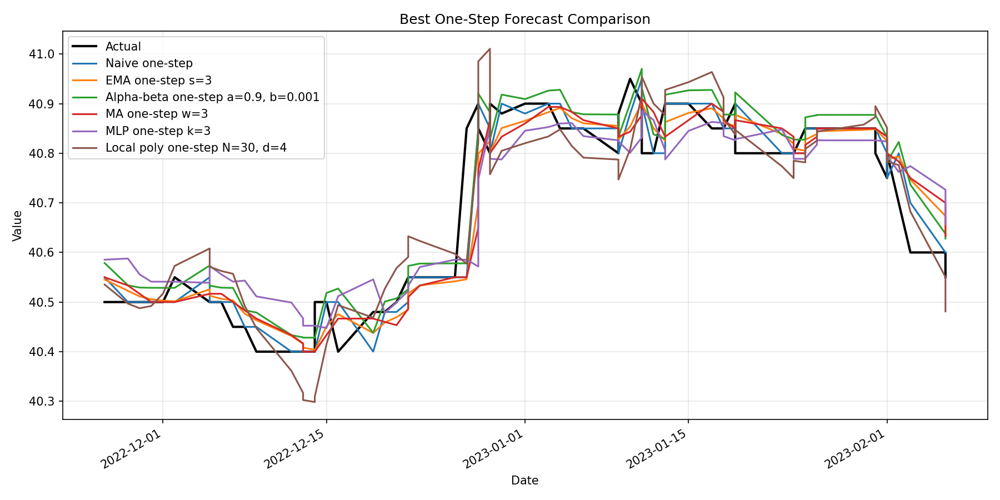
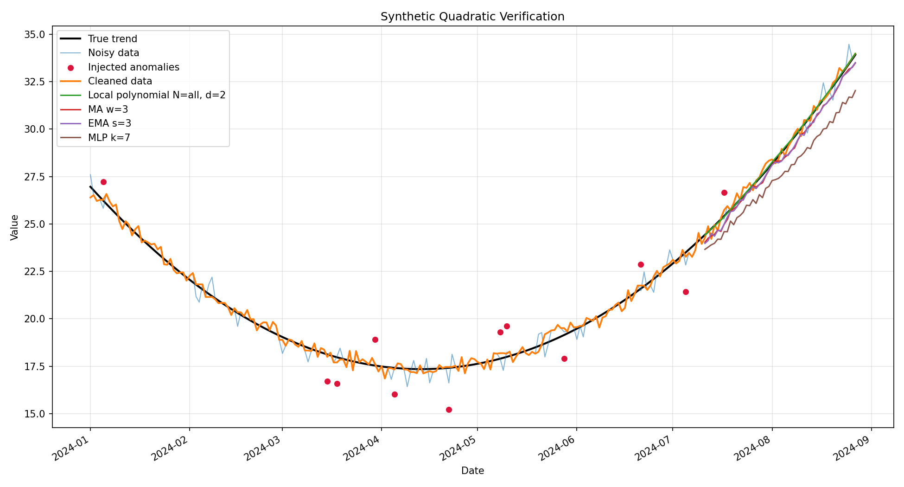

# Time Series Forecasting System

## Опис

**Time Series Forecasting System** — навчальний проєктний практикум за ЛР1,2 з дисципліни **"Технології Data Science"**.

Проєкт реалізує відтворюваний pipeline для аналізу та прогнозування часових рядів: завантаження реальних даних, попередню обробку, базову аналітику, виявлення та очищення аномалій, прогнозування кількома групами методів, оцінювання якості моделей, формування рекомендацій і перевірку підходів на синтетичних даних.

Основний приклад — часовий ряд курсу **Oschadbank USD**.

## Дані

У проєкті використано часовий ряд **Oschadbank USD exchange rate**.

Основні файли даних:

- raw data: [`data/raw/Oschadbank_USD.xls`](data/raw/Oschadbank_USD.xls);
- processed data: [`data/processed/oschadbank_usd_clean.csv`](data/processed/oschadbank_usd_clean.csv);
- anomaly-cleaned data: [`data/processed/oschadbank_usd_cleaned_anomalies.csv`](data/processed/oschadbank_usd_cleaned_anomalies.csv).

Нульові значення валютного курсу трактуються як некоректні виміри або пропуски, оскільки реальний курс валюти не може дорівнювати `0`.

## Що реалізує pipeline

Основний pipeline у [`scripts/run_pipeline.py`](scripts/run_pipeline.py) виконує такі етапи:

- loading: завантаження Excel-файлу з реальними даними;
- preprocessing: нормалізація назв колонок, парсинг дат, сортування за часом, обробка пропусків;
- basic statistics / EDA: базові статистики та графік вихідного ряду;
- anomaly detection and cleaning: z-score, IQR, rolling median та R&D adaptive detector;
- forecasting: baseline, polynomial/local polynomial, MA/EMA, MLP, alpha-beta filter;
- model evaluation: MAE, RMSE, MAPE, R2;
- recommendations: рекомендації щодо доцільності використання моделей;
- synthetic verification: перевірка на синтетичних рядах linear/quadratic/exponential.

Основні результати зберігаються в:

- [`reports/metrics/`](reports/metrics/);
- [`reports/figures/`](reports/figures/).

## R&D component for Task IV, item 5.1

Для пункту 5 проектного практикуму було обрано **пункт 5.1**:

> розробити власний алгоритм виявлення аномальних вимірів та/або навчання параметрів відомих алгоритмів, який бачить властивості статистичної вибірки.

У проєкті реалізовано власний **Adaptive Local MAD Anomaly Detector**. Реалізація знаходиться у [`src/anomaly_detection.py`](src/anomaly_detection.py), основна функція — `detect_adaptive_local_mad_anomalies`.

Це не простий z-score/IQR detector і не виклик готового stock-алгоритму. Метод використовує власну комбінацію локальних robust-статистик:

- `local_trend` через rolling median;
- `local_mad` як локальну robust-оцінку шуму;
- `amplitude_score` для оцінки відхилення від локального тренду;
- `derivative_score` для оцінки нетипових локальних стрибків;
- `final_score` як діагностичний інтегральний score;
- robust floors для MAD та step MAD, щоб уникнути division by tiny value на стабільних ділянках;
- zero/non-zero diagnostics для розділення нульових помилкових вимірів і ненульових аномалій;
- synthetic verification з TP/FP/FN, precision, recall, F1.

Метод порівнюється зі стандартними anomaly detection підходами:

- `z_score`;
- `iqr`;
- `rolling_median`;
- `adaptive_local_mad`.

### Фактичні результати adaptive detector

За результатами поточного запуску на real data:

```text
total_anomalies:    66
zero_anomalies:     39
non_zero_anomalies: 27
```

Перевірка фінального очищеного ряду:

```text
final_cleaned_value missing: 0
final_cleaned_value zeros:   0
```

Synthetic verification для `adaptive_local_mad`:

```text
linear F1:      0.5926
quadratic F1:   0.6486
exponential F1: 0.5455
```

Ці результати не є твердженням про універсальну перевагу adaptive detector над усіма іншими методами. Вони показують, що R&D-компонент має окрему реалізацію, діагностику, порівняння зі стандартними методами та перевірку на синтетичних даних.

### R&D artifacts

Основні артефакти R&D-частини:

- [`reports/metrics/adaptive_anomaly_report.json`](reports/metrics/adaptive_anomaly_report.json);
- [`reports/metrics/synthetic_verification.json`](reports/metrics/synthetic_verification.json);
- [`reports/figures/adaptive_anomalies_detected.png`](reports/figures/adaptive_anomalies_detected.png);
- [`reports/figures/anomaly_methods_comparison.png`](reports/figures/anomaly_methods_comparison.png).

## Реалізовані методи

### Preprocessing та EDA

Файли:

- [`src/data_loader.py`](src/data_loader.py);
- [`src/preprocessing.py`](src/preprocessing.py);
- [`src/statistics.py`](src/statistics.py).

Реалізовано завантаження Excel-даних, нормалізацію колонок, парсинг дат, сортування ряду, обробку пропусків і базові статистики.

### Anomaly detection

Файл:

- [`src/anomaly_detection.py`](src/anomaly_detection.py).

Реалізовані методи:

- `z_score`;
- `iqr`;
- `rolling_median`;
- `adaptive_local_mad` як R&D-компонент для пункту 5.1.

Звіти:

- [`reports/metrics/anomaly_report.json`](reports/metrics/anomaly_report.json);
- [`reports/metrics/adaptive_anomaly_report.json`](reports/metrics/adaptive_anomaly_report.json).

### Statistical learning та baseline-моделі

Файли:

- [`src/models/baseline.py`](src/models/baseline.py);
- [`src/models/polynomial.py`](src/models/polynomial.py).

Реалізовано naive one-step/recursive baseline, global polynomial та local polynomial моделі. Global polynomial залишено як порівняльний метод; за наявними метриками він працює погано на цьому нестаціонарному валютному ряді.

### Approximation methods

Файл:

- [`src/models/approximation.py`](src/models/approximation.py).

Реалізовано:

- moving average;
- exponential moving average;
- recursive та one-step режими;
- підбір параметрів на validation split.

### Deep learning

Файл:

- [`src/models/deep_learning.py`](src/models/deep_learning.py).

Реалізовано MLP-based one-step forecasting зі sliding window. MLP використовується як deep learning метод прогнозування, але не подається як власний R&D-алгоритм.

### Alpha-beta filter

Файл:

- [`src/models/alpha_beta_filter.py`](src/models/alpha_beta_filter.py).

Реалізовано:

- `alpha_beta_recursive`;
- `alpha_beta_one_step`;
- підбір `alpha` та `beta` на validation split.

Звіт:

- [`reports/metrics/alpha_beta_metrics.json`](reports/metrics/alpha_beta_metrics.json).

### Synthetic verification

Файли:

- [`src/synthetic.py`](src/synthetic.py);
- [`scripts/run_synthetic_experiment.py`](scripts/run_synthetic_experiment.py).

Синтетична перевірка використовує три типи трендів:

- linear;
- quadratic;
- exponential.

Для anomaly detection зберігаються TP/FP/FN, precision, recall і F1 для `z_score`, `iqr`, `rolling_median`, `adaptive_local_mad`.

## Основні результати прогнозування

Оцінювання виконано на хронологічному поділі `70/10/20`: train, validation, test. Підбір параметрів виконується на train/validation, фінальна оцінка — на test.

Ключові метрики зберігаються у [`reports/metrics/forecast_metrics.json`](reports/metrics/forecast_metrics.json).

Стислий висновок за поточними результатами:

- `naive_one_step` має найменший RMSE серед протестованих методів на final test split: `0.0581`.
- `alpha_beta_one_step` та `exponential_moving_average_one_step` мають близьку якість і можуть бути корисними для online-згладжування.
- Recursive-методи накопичують похибку на довшому горизонті.
- `global_polynomial` працює погано на цьому ряді, тому його варто розглядати як baseline/контрастний приклад, а не як рекомендований метод.
- `deep_learning_mlp_one_step` працює працездатно, але не перевершує найкращі короткострокові one-step підходи на цьому наборі даних.

## Приклади графіків

### Original series with anomalies



### Adaptive Local MAD anomalies



### Anomaly methods comparison



### Cleaned vs Original



### Forecast comparison



### Synthetic quadratic verification



## Структура проєкту

```text
.
|-- data/
|   |-- raw/                  # сирі дані Oschadbank USD
|   `-- processed/            # оброблені та очищені дані
|-- src/
|   |-- data_loader.py        # завантаження даних
|   |-- preprocessing.py      # попередня обробка
|   |-- anomaly_detection.py  # anomaly detection, включно з adaptive_local_mad
|   |-- statistics.py         # базова статистика / EDA
|   |-- synthetic.py          # генерація синтетичних рядів
|   |-- evaluation.py         # метрики оцінювання
|   |-- visualization.py      # побудова графіків
|   `-- models/
|       |-- baseline.py
|       |-- polynomial.py
|       |-- approximation.py
|       |-- deep_learning.py
|       `-- alpha_beta_filter.py
|-- scripts/
|   |-- run_pipeline.py
|   `-- run_synthetic_experiment.py
|-- reports/
|   |-- figures/              # PNG-графіки
|   `-- metrics/              # JSON-метрики та звіти
|-- requirements.txt
`-- README.md
```

## Як запустити

Встановити залежності:

```bash
pip install -r requirements.txt
```

Запустити основний pipeline для реальних даних:

```bash
python scripts/run_pipeline.py
```

Запустити synthetic verification:

```bash
python scripts/run_synthetic_experiment.py
```

Після запуску результати зберігаються в:

- [`reports/figures/`](reports/figures/);
- [`reports/metrics/`](reports/metrics/).

## Покриття вимог практикуму

| Вимога | Де реалізовано | Статус |
|---|---|---|
| Реальні time series дані | `data/raw/Oschadbank_USD.xls`, `src/data_loader.py` | реалізовано |
| EDA / базова статистика | `src/statistics.py`, `reports/metrics/basic_statistics.json`, `reports/figures/oschadbank_usd_series.png` | реалізовано |
| Anomaly cleaning | `src/anomaly_detection.py`, `reports/metrics/anomaly_report.json`, `data/processed/oschadbank_usd_cleaned_anomalies.csv` | реалізовано |
| Statistical learning | `src/models/baseline.py`, `src/models/polynomial.py`, `reports/metrics/forecast_metrics.json` | реалізовано |
| Approximation | `src/models/approximation.py`, `reports/figures/approximation_selection.png` | реалізовано |
| Deep learning | `src/models/deep_learning.py`, `reports/figures/deep_learning_forecast.png` | реалізовано |
| Alpha-beta filter | `src/models/alpha_beta_filter.py`, `reports/metrics/alpha_beta_metrics.json`, `reports/figures/alpha_beta_forecast.png` | реалізовано |
| Synthetic verification | `src/synthetic.py`, `scripts/run_synthetic_experiment.py`, `reports/metrics/synthetic_verification.json` | реалізовано |
| Recommendations | `reports/metrics/model_recommendations.json` | реалізовано |
| Task IV item 5.1 / R&D anomaly detector | `detect_adaptive_local_mad_anomalies`, `reports/metrics/adaptive_anomaly_report.json` | реалізовано |
| Task IV item 5.2 / nonlinear-in-parameters власна модель | не обиралось | не реалізовувалось, бо для пункту 5 було обрано 5.1 |

## English Summary

**Time Series Forecasting System** is an educational Data Science project for Lab Work 1-2 project practice. It uses real Oschadbank USD exchange-rate time series data and implements preprocessing, basic EDA, anomaly detection and cleaning, forecasting, model evaluation, recommendations, and synthetic verification.

For Task IV item 5, the project implements item **5.1**: a custom Adaptive Local MAD anomaly detector. The method is not claimed to be universally best; it is an R&D component based on local robust statistics, amplitude and derivative scores, diagnostic `final_score`, and synthetic verification.

To run the project:

```bash
pip install -r requirements.txt
python scripts/run_pipeline.py
python scripts/run_synthetic_experiment.py
```

Generated metrics and figures are stored in `reports/metrics/` and `reports/figures/`.

